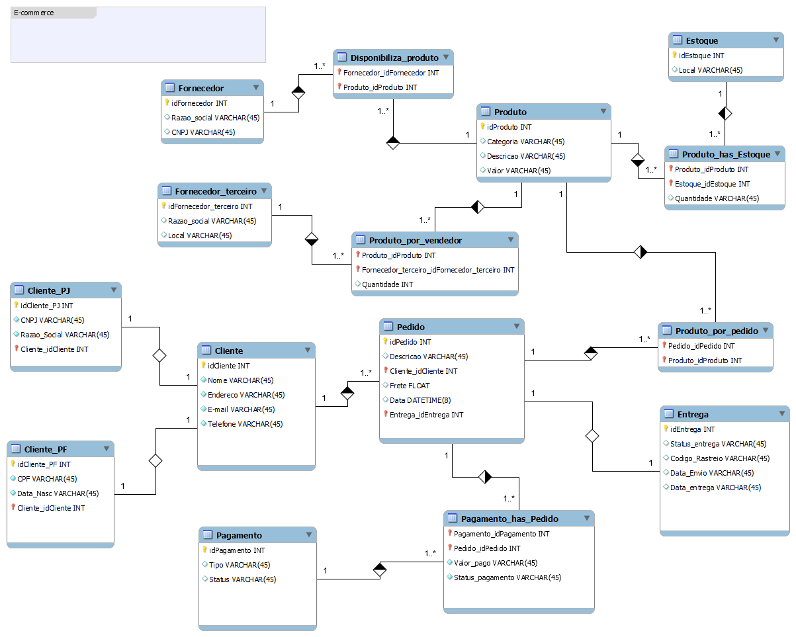

# E-Commerce  

## 📌 Descrição do Desafio  
Este cenário de **Modelagem Lógica de Banco de Dados** foi desenvolvido durante o bootcamp **Randstad - Análise de Dados**, no curso **Sistemas relacionais em banco de dados**.  

A atividade faz parte da etapa **"Refinando um Projeto Conceitual de Banco de Dados – E-COMMERCE"**, onde foi necessário aprimorar o modelo inicial para representar de forma mais realista as operações de um sistema de comércio eletrônico.  

---

## 🎯 Objetivo  
O esquema foi refinado para contemplar os seguintes pontos:  

✔️ Cliente PJ e PF – Uma conta pode ser **Pessoa Jurídica** ou **Pessoa Física**, mas não pode ter as duas informações simultaneamente;  
✔️ Pagamento – Um pedido pode ter **mais de uma forma de pagamento** registrada;  
✔️ Entrega – Possui **status, código de rastreio, data de envio e data de entrega**;  
✔️ Produtos e Estoque – Controle de disponibilidade de produtos por estoque e fornecedores;  
✔️ Fornecedores diretos e terceiros – Diferenciação entre quem fornece para a loja e quem vende diretamente.  

---

## 🗂️ Entidades  
- ✔️ **Cliente** (Pessoa Física / Pessoa Jurídica)  
- ✔️ **Pedido**  
- ✔️ **Produto**  
- ✔️ **Fornecedor**  
- ✔️ **Fornecedor Terceiro**  
- ✔️ **Estoque**  
- ✔️ **Entrega**  
- ✔️ **Pagamento**  

---

## 🔗 Relacionamentos  
- ✔️ **Realiza** → Cliente faz Pedido  
- ✔️ **Possui** → Pedido possui Entrega  
- ✔️ **Contém** → Pedido contém Produto  
- ✔️ **Fornece** → Fornecedor fornece Produto  
- ✔️ **Vende** → Fornecedor Terceiro vende Produto  
- ✔️ **Disponibiliza** → Produto está em Estoque  
- ✔️ **Registra** → Pedido pode ter Pagamento(s)  

---

## 📊 Modelo Entidade-Relacionamento (MER)  

  

  

---

## ✅ Status do Projeto  
Este modelo reflete um **sistema de e-commerce robusto**, cobrindo:  

- Clientes PF e PJ  
- Relacionamento de fornecedores diretos e terceiros  
- Controle de pedidos com múltiplos produtos  
- Pagamentos múltiplos por pedido  
- Entregas rastreáveis  

---