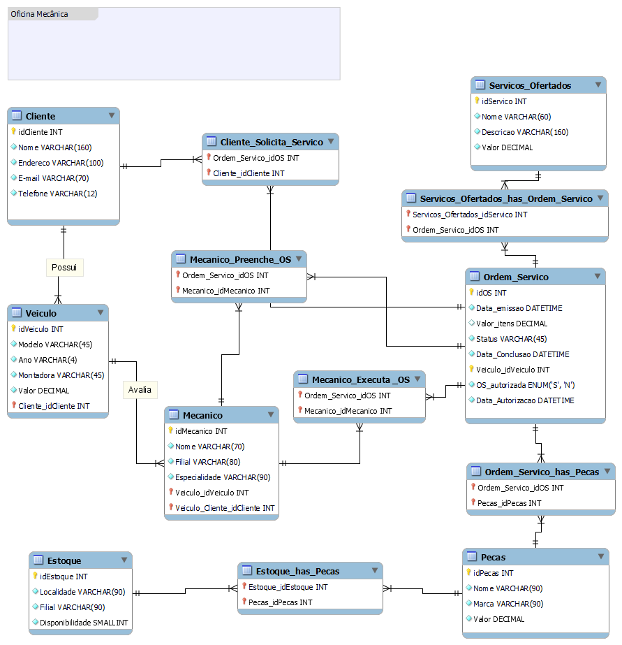

# 🛠️ Oficina Mecânica  

## 📌 Descrição do Desafio  
Este projeto faz parte de um desafio de **Modelagem Conceitual de Banco de Dados**, cujo objetivo foi desenvolver um **Modelo Entidade-Relacionamento (MER)** para representar o funcionamento de uma **oficina mecânica**.  

A partir da narrativa fornecida e de suposições adicionais, o esquema foi construído para contemplar todas as entidades, atributos e relacionamentos necessários para controlar **ordens de serviço, veículos, clientes, mecânicos, serviços e peças**.  

---

## 🎯 Objetivo  
O modelo busca atender os seguintes pontos principais:  

✔️ Controle de **Clientes** e seus **Veículos**;  
✔️ Registro de **Ordens de Serviço (OS)** com status, datas e valores;  
✔️ Associação da OS a **Serviços ofertados** e **Peças utilizadas**;  
✔️ Garantia de que a execução da OS depende da **autorização do cliente**;  
✔️ Mecânicos **avaliam, preenchem e executam** as OS;  
✔️ Inclusão de **Estoque de peças** e disponibilidade;  
✔️ Registro do papel do **Cliente como solicitante** de serviços.  

---

## 🗂️ Entidades  
- **Cliente** → dados pessoais e de contato.  
- **Veículo** → modelo, ano, montadora e valor de referência.  
- **Mecânico** → código, nome, filial, especialidade.  
- **Ordem de Serviço (OS)** → número, datas, valor, status, autorização.  
- **Serviços_Ofertados** → catálogo de serviços disponíveis, com valores de mão-de-obra.  
- **Peças** → componentes usados na execução das ordens de serviço.  
- **Estoque** → controle de disponibilidade e localização de peças.  

---

## 🔗 Relacionamentos  
- **Possui** → Cliente possui Veículo.  
- **Cliente_Solicita_Servico** → cliente solicita a abertura de uma OS.  
- **Mecanico_Preenche_OS** → mecânico registra a OS no sistema.  
- **Mecanico_Executa_OS** → mecânico executa os serviços da OS.  
- **Avalia** → mecânico avalia o veículo.  
- **Servicos_Ofertados_has_Ordem_Servico** → relação N:N entre serviços e ordens de serviço.  
- **Ordem_Servico_has_Pecas** → relação N:N entre peças e ordens de serviço.  
- **Estoque_has_Pecas** → relação N:N entre estoque e peças.  

---

## 📊 Modelo Entidade-Relacionamento (MER)  

  

  

---

## ✅ Status do Projeto  
O modelo reflete de forma consistente a narrativa original, com alguns **aperfeiçoamentos de modelagem**:  

- Inclusão do **Estoque** para controle de disponibilidade de peças;  
- Criação de tabelas associativas (**Cliente_Solicita_Servico**, **Ordem_Servico_has_Pecas**, **Servicos_Ofertados_has_Ordem_Servico**) para lidar com relacionamentos N:N;  
- Atributo **OS_autorizada (S/N)** e **Data_Autorizacao** para atender o requisito de aprovação do cliente.  

Essas decisões tornam o modelo mais próximo de um cenário real de oficina mecânica, permitindo melhor rastreabilidade e controle dos processos.  
