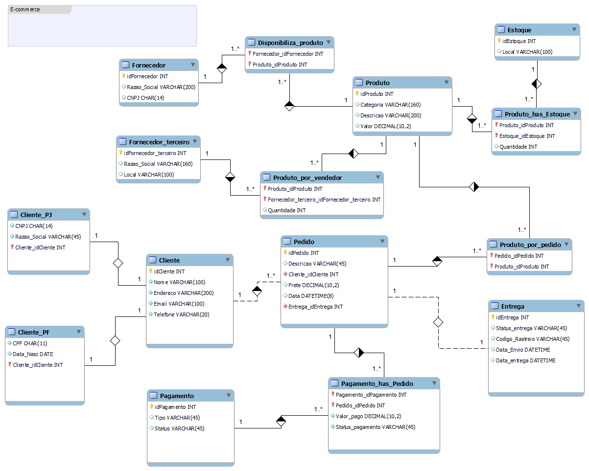

# 🛒 Projeto de Modelagem Lógica – E-Commerce

## Descrição do Desafio

Este projeto tem como objetivo **replicar e aprimorar o modelo lógico de banco de dados para um cenário de E-Commerce**, com foco em refletir regras reais de negócio e boas práticas de modelagem relacional.  

O desafio consiste em criar o **modelo lógico (MER)**, **gerar o script SQL completo** para o banco de dados `ecommerce`, **popular as tabelas com dados de teste** e **garantir integridade referencial entre todas as entidades**.

A modelagem foi refinada para contemplar aspectos essenciais de um ambiente de comércio eletrônico, incluindo controle de clientes (PF e PJ), múltiplas formas de pagamento, rastreamento de entregas e relacionamento entre produtos, fornecedores e estoques.

---

## Diretrizes

✔️ Replicar a modelagem lógica de um banco de dados de e-commerce  
✔️ Criar o **script SQL** de criação das tabelas, chaves primárias e estrangeiras  
✔️ Inserir **15 registros em cada tabela** com dados consistentes e realistas  
✔️ Garantir o uso correto de **constraints** (`PK`, `FK`, `UNIQUE`, `NOT NULL`, `AUTO_INCREMENT`)  
✔️ Aplicar **ON DELETE** e **ON UPDATE** adequados às relações entre entidades  
✔️ Preparar o banco para consultas complexas utilizando `JOIN`, `GROUP BY`, `HAVING`, `ORDER BY`, entre outras cláusulas  
✔️ Documentar o modelo lógico e o raciocínio das escolhas feitas no projeto  

---

## Objetivos do Desafio

O modelo lógico foi refinado para incluir os seguintes pontos:

- ✔️ **Cliente PJ e PF** – Uma conta pode ser **Pessoa Física** ou **Pessoa Jurídica**, mas **não ambas simultaneamente**;  
- ✔️ **Pagamento** – Possibilidade de múltiplas formas de pagamento associadas a um pedido;  
- ✔️ **Entrega** – Inclusão de **status da entrega** e **código de rastreio**;  
- ✔️ **Relacionamentos normalizados** entre produtos, fornecedores e estoques;  
- ✔️ **Controle de pedidos** com histórico de pagamento e status de entrega;  
- ✔️ **Regras de integridade** bem definidas, garantindo consistência nas operações de inserção, atualização e exclusão.

---

## Estrutura Geral do Banco de Dados

O banco de dados `ecommerce` foi estruturado com as seguintes tabelas:

| Tabela | Descrição |
|--------|------------|
| **Cliente** | Cadastro principal de clientes |
| **Cliente_PF** | Informações complementares de Pessoa Física (CPF e data de nascimento) |
| **Cliente_PJ** | Informações complementares de Pessoa Jurídica (CNPJ e razão social) |
| **Pagamento** | Registro das formas e status de pagamento |
| **Entrega** | Controle de status, datas e código de rastreio |
| **Pedido** | Registro das compras realizadas pelos clientes |
| **Produto** | Catálogo de produtos disponíveis |
| **Fornecedor** | Fornecedores internos da loja |
| **Fornecedor_terceiro** | Fornecedores/vendedores externos (marketplace) |
| **Estoque** | Locais e quantidades disponíveis de produtos |
| **Produto_has_Estoque** | Relação entre produtos e estoques (com quantidade) |
| **Produto_por_vendedor** | Relação entre produtos e fornecedores terceiros |
| **Disponibiliza_produto** | Relação entre produtos e fornecedores internos |
| **Produto_por_pedido** | Relação entre produtos e pedidos realizados |
| **Pagamento_has_Pedido** | Relação entre pagamentos e pedidos, com valores e status |

---

## Regras de Integridade (ON DELETE / ON UPDATE)

| Relação | Ação |
|----------|------|
| `Cliente` → `Cliente_PF` / `Cliente_PJ` | `ON DELETE CASCADE` – Exclui os dados de PF/PJ ao excluir o cliente |
| `Cliente` → `Pedido` | `ON DELETE CASCADE` – Remove pedidos vinculados ao cliente |
| `Pedido` → `Pagamento_has_Pedido` / `Produto_por_pedido` | `ON DELETE CASCADE` – Garante integridade nas exclusões |
| `Produto` → Relacionamentos (Estoque, Fornecedor, Pedido) | `ON DELETE CASCADE` – Evita registros órfãos de produtos |
| `Fornecedor` → `Disponibiliza_produto` | `ON DELETE CASCADE` – Mantém a consistência entre fornecedor e produtos |
| `Estoque` → `Produto_has_Estoque` | `ON DELETE CASCADE` – Remove relações ao excluir o estoque |

Essas regras asseguram **consistência referencial total**, permitindo que exclusões em cascata não deixem dependências inválidas no banco de dados.

---

## Estrutura de Dados para Testes

Para validar a integridade e o funcionamento do modelo, foram inseridos **15 registros em cada tabela**.  
Os dados simulam um ambiente realista de e-commerce, incluindo:

- Clientes PF e PJ com dados distintos;  
- Pedidos com diferentes status de entrega;  
- Produtos com valores variados e categorias genéricas;  
- Pagamentos em múltiplas modalidades (Crédito, Débito, Pix, Boleto, PayPal);  
- Entregas com códigos de rastreio e datas de envio/entrega;  
- Relacionamentos entre produtos, fornecedores e estoques.  

Esses dados permitem a execução de consultas complexas para validação do modelo.

---

## Modelo Lógico

