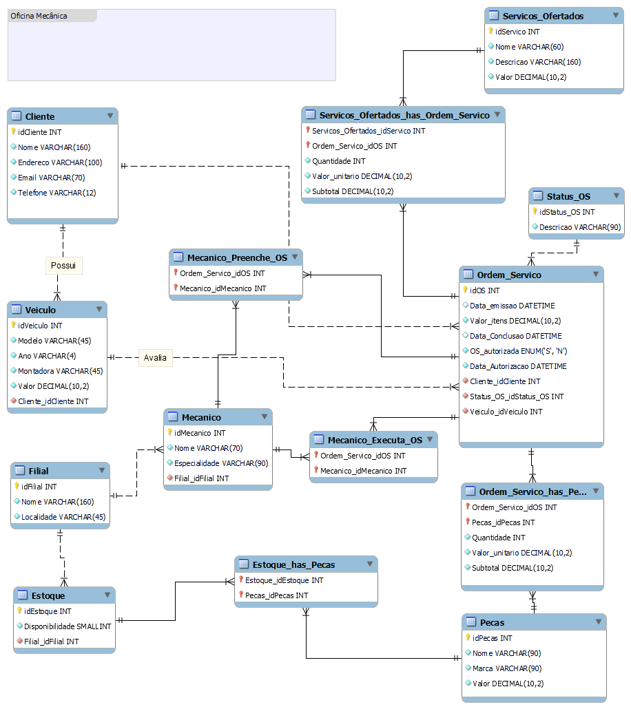

# Projeto Banco de Dados – Oficina Mecânica

## Descrição do Desafio

O objetivo deste desafio é aplicar os conhecimentos de modelagem de banco de dados para construir um **esquema lógico relacional completo** com base em um **modelo conceitual (ER)** já desenvolvido no módulo anterior.  
O cenário proposto representa o funcionamento de uma **Oficina Mecânica**, incluindo o gerenciamento de clientes, veículos, ordens de serviço, peças, serviços, mecânicos e filiais.

O projeto envolve todas as etapas do processo de desenvolvimento de um banco de dados:

1. Criação do **modelo lógico relacional** a partir do modelo conceitual.  
2. Geração do **script SQL (DDL)** para criação das tabelas, chaves primárias e estrangeiras, restrições e relacionamentos.  
3. **Inserção de dados (DML)** para testes de integridade e consistência.  
4. Elaboração de **consultas SQL (queries)** abrangendo diferentes tipos de cláusulas e operações.  

---

## Modelo Lógico (MER)

O modelo lógico foi desenvolvido com base no diagrama conceitual da Oficina Mecânica e traduzido para o modelo relacional.  
O diagrama foi aprimorado para garantir normalização, integridade referencial e clareza entre relacionamentos N:N.

**Arquivo:** `mer_oficina_mecanica_melhorado.png`

---

## Estrutura do Banco de Dados

**Banco de dados:** `oficina_mec`  
**Modelo:** Relacional – 3ª Forma Normal (3FN)  
**SGDB:** MySQL 8.0+

### Principais Entidades e Descrições

| Tabela | Descrição |
|--------|------------|
| `Cliente` | Cadastro de clientes (PF e PJ) com dados de contato e e-mail único |
| `Veiculo` | Veículos vinculados aos clientes, com controle de ano de fabricação e montadora |
| `Filial` | Unidades da oficina |
| `Mecanico` | Funcionários associados a uma filial |
| `Status_OS` | Situação da ordem de serviço (Em execução, Concluída, Cancelada) |
| `Ordem_Servico` | Dados principais da OS: cliente, veículo, mecânico, status, datas e valor total |
| `Pecas` | Peças cadastradas com preço e controle de estoque |
| `Servicos_Ofertados` | Serviços realizados pela oficina, com valor unitário |
| `Estoque` | Controle de peças disponíveis por filial |
| `Ordem_Servico_has_Pecas` | Relação N:N entre OS e peças, com cálculo de subtotal |
| `Servicos_Ofertados_has_Ordem_Servico` | Relação N:N entre serviços e OS, com subtotal |
| `Mecanico_Preenche_OS` | Registro do mecânico responsável pelo preenchimento da OS |
| `Mecanico_Executa_OS` | Registro do mecânico responsável pela execução da OS |

---

## Script SQL – Estrutura (DDL)

**Arquivo:** `Criacao_de_tabelas.md`

O script SQL contém:

- Criação de todas as tabelas e chaves primárias;  
- Definição de **foreign keys** com `ON DELETE CASCADE` e `ON UPDATE CASCADE`;  
- **CHECK constraints** para validação de valores (ex.: ano de fabricação, quantidade, valor positivo);  
- Campos **gerados ou derivados** (como `Subtotal`) definidos via expressão aritmética simples;  
- Tipos de dados otimizados conforme o contexto (ex.: `DECIMAL`, `VARCHAR`, `DATE`).

---

## Consultas SQL (Queries)

**Arquivo:** `Queries.md`

As consultas criadas atendem **todas as cláusulas exigidas no desafio**, demonstrando diferentes operações de recuperação e análise de dados.

### Cláusulas obrigatórias e onde são aplicadas:

| Cláusula | Aplicação | Exemplo de Query |
|-----------|------------|------------------|
| `SELECT` | Recuperação de informações básicas | Listar todos os serviços realizados |
| `WHERE` | Filtro de registros | Filtrar OS da montadora Chevrolet |
| `ORDER BY` | Ordenação de resultados | Ordenar OS por valor total |
| `HAVING` | Filtro sobre agrupamentos | Exibir clientes com mais de 1 carro atendido |
| `JOIN` | Combinação de tabelas | Consultar OS e peças utilizadas |
| Expressões derivadas | Criação de atributos calculados | Calcular duração da OS em dias |

---

### Exemplos de consultas implementadas

1. Todos os serviços prestados por um mecânico específico.  
2. Quantas ordens de serviço cada cliente já solicitou.  
3. Todas as ordens de serviço em que o carro é da **montadora Chevrolet**.  
4. OS em que o carro é **Chevrolet** e o **ano de fabricação < 2015**.  
5. Todas as OS **concluídas**.  
6. Todas as OS **em execução**.  
7. OS com **duração superior a 5 dias**.  
8. Clientes que solicitaram **OS para mais de um veículo**.  
9. Valor total gasto por cliente em serviços e peças.  
10. Ranking de **mecânicos com mais serviços executados**.

---

## Aderência aos Requisitos do Desafio

| Requisito | Situação | Observação |
|------------|-----------|-------------|
| Esquema lógico criado a partir do modelo conceitual | ✅ | Diagrama lógico representado no arquivo `mer_oficina_mecanica_melhorado.png` |
| Script SQL para criação do banco (DDL) | ✅ | Inclui todas as tabelas, constraints e relacionamentos |
| Persistência de dados para teste (DML) | ✅ | Conjunto completo de inserts |
| Queries com `SELECT`, `WHERE`, `ORDER BY`, `HAVING` e `JOIN` | ✅ | Todas presentes em múltiplas consultas |
| Expressões para atributos derivados | ✅ | Implementadas no cálculo de duração e subtotais |
| Repositório GitHub com README explicativo | ✅ | Este arquivo documenta o contexto lógico e técnico |