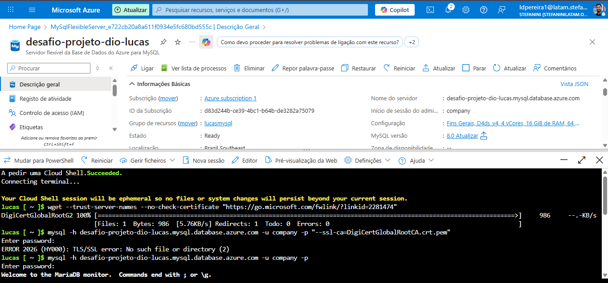
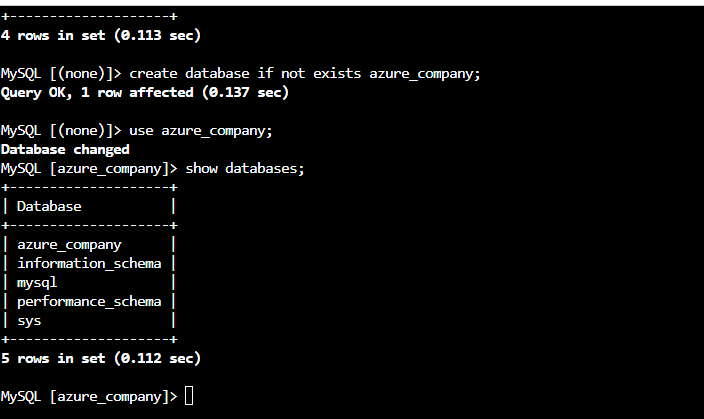
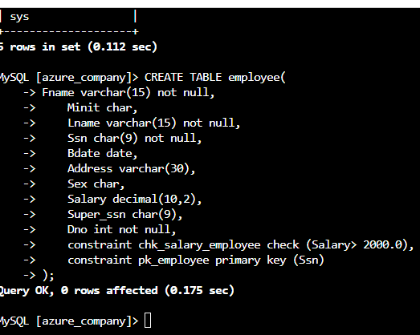
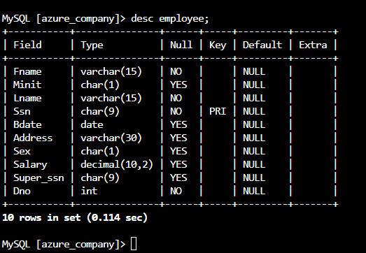
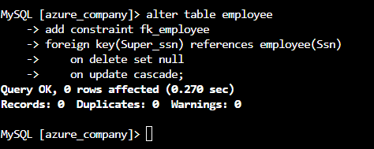
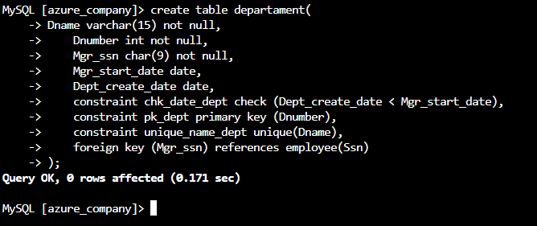

# Projeto Banco de Dados – Azure Company

## Descrição do Desafio

O objetivo deste projeto é realizar a **análise completa e transformação de dados** do banco de dados **Azure Company**, aplicando técnicas avançadas de **limpeza, normalização e enriquecimento de dados** para permitir a criação de relatórios e dashboards estratégicos no **Power BI**.

O projeto envolveu todas as etapas do processo de desenvolvimento de uma solução de Business Intelligence:

- Criação do esquema do banco de dados com constraints e relações  
- Análise profunda da estrutura existente e verificação de integridade dos dados  
- Transformação e limpeza de dados seguindo **13 diretrizes específicas**  
- Desenvolvimento de consultas SQL analíticas para business intelligence  
- Criação de dashboards interativos no Power BI para visualização estratégica  

---

## Desafios Técnicos Enfrentados

### Ambiente e Infraestrutura

- **Dificuldades com Azure:** Processos de criação de ambiente virtual em constante mudança e falta de recursos disponíveis para alocação adequada  
- **Gaps na Documentação:** Documentação da Azure desatualizada ou incompleta para alguns serviços específicos  
- **Discrepância de Ambientes:** Ambiente demonstrado pelo instrutor significativamente diferente do ambiente atual disponível para desenvolvimento  
- **Workaround Adotado:** Utilização de ambiente local com MySQL e Power BI para garantir a continuidade do projeto  

### Adaptações Realizadas

- Migração de soluções cloud para ambiente on-premise  
- Desenvolvimento de scripts alternativos para contornar limitações de recursos  
- Criação de ambiente de desenvolvimento local replicável  

---

## Modelo Lógico do Banco de Dados

O banco de dados **Azure Company** foi modelado seguindo as melhores práticas de normalização, com relacionamentos bem definidos e constraints de integridade referencial.

### Esquema Principal

- **Tabela Central:** `employee` com auto-relacionamento para hierarquia  
- **Departamentos:** `departament` com gerentes e múltiplas localizações  
- **Projetos:** `project` vinculados a departamentos  
- **Alocações:** `works_on` para controle de horas em projetos  
- **Dependentes:** `dependent` para informações familiares  

---

## Estrutura do Banco de Dados

- **Banco de dados:** `azure_company`  
- **Modelo:** Relacional → Transformado para Modelo Estrela  
- **SGDB:** MySQL 8.0+  

### Entidades Principais

| Tabela | Descrição | Chave Primária | Constraints Importantes |
|--------|------------|----------------|--------------------------|
| employee | Cadastro de colaboradores | Ssn | CHECK Salary > 2000, FK Super_ssn |
| departament | Departamentos da empresa | Dnumber | UNIQUE Dname, CHECK datas |
| dept_locations | Localizações dos departamentos | (Dnumber, Dlocation) | FK CASCADE |
| project | Projetos da empresa | Pnumber | UNIQUE Pname |
| works_on | Alocação em projetos | (Essn, Pno) | FK employee e project |
| dependent | Dependentes | (Essn, Dependent_name) | FK employee |

---

## Script SQL – Estrutura (DDL)

**Arquivo:** `azure_company_schema.sql`

### Características do Schema

- Constraints de `CHECK` para validação de salários e datas  
- `Foreign Keys` com ações `ON DELETE CASCADE` e `ON UPDATE CASCADE`  
- Chaves compostas para tabelas de relacionamento N:N  
- Valores únicos para nomes de departamentos e projetos  
- Auto-relacionamento na tabela `employee` para hierarquia  

### Trechos Destacados do DDL

```sql
-- Constraint para salário mínimo
constraint chk_salary_employee check (Salary > 2000.0);

-- Auto-relacionamento hierárquico
foreign key (Super_ssn) references employee(Ssn);

-- Constraints de integridade referencial
on delete cascade
on update cascade;


Consultas SQL Analíticas Desenvolvidas
Arquivo: queries_azure_company.sql

Categorias de Consultas Implementadas:
Consultas de Negócio

-- Localização de departamentos
SELECT Dname as Department, concat(Fname, ' ', Lname) as Manager 
FROM departament d, dept_locations l, employee e
WHERE d.Dnumber = l.Dnumber AND Mgr_ssn = e.Ssn;

-- Projetos por localização
SELECT Pnumber, Dnum, Lname, Address, Bdate
FROM project, departament, employee
WHERE Dnum = Dnumber AND Mgr_ssn = Ssn AND Plocation = 'Stafford';


Consultas Financeiras

-- Cálculo de INSS
SELECT Fname, Lname, Salary, round(Salary*0.011,2) as INSS 
FROM employee;

-- Aumentos salariais para projetos específicos
SELECT e.Fname, e.Lname, 1.1*e.Salary as increased_sal 
FROM employee as e, works_on as w, project as p 
WHERE e.Ssn = w.Essn AND w.Pno = p.Pnumber AND p.Pname='ProductX';

Consultas de Recursos Humanos

-- Estrutura hierárquica
SELECT e.Fname, e.Lname, e.Address 
FROM employee e, departament d
WHERE d.Dname = 'Research' AND d.Dnumber = e.Dno;
```

# Diretrizes de Transformação Aplicadas
✅ Requisitos Implementados com Sucesso

| Requisito	| Status | Método de Implementação|
|-----------|--------|------------------------|
| 1	Verificação de cabeçalhos e tipos de dados	| ✅ |	Análise completa via DESC e INFORMATION_SCHEMA|
| 2	Modificação valores monetários para DOUBLE	| ✅	| Conversão da coluna Salary para tipo preciso |
| 3	Verificação de nulos e análise de remoção	| ✅	| Consultas analíticas de integridade |
| 4	Employees com nulos em Super_ssn (gerentes)	| ✅	| Identificação hierárquica e mapeamento |
|5	Departamentos sem gerente	| ✅	| Validação cruzada com tabela departament |
|6	Preenchimento de lacunas em gerentes |	✅ |	Associação lógica baseada na hierarquia |
|7	Número de horas dos projetos	| ✅ |	Análise via SUM, AVG em works_on |
|8	Separar colunas complexas	|✅ |	Divisão do Address em componentes |
|9	Mescla employee + departament	|✅|	VIEW com LEFT JOIN para preservar dados |
|10	Eliminação colunas desnecessárias|	✅|	Otimização durante transformação no Power BI |
|11	Junção colaboradores + gerentes|	✅|	Consulta SQL com auto-join e departament |
|12	Mescla nome e sobrenome	|✅|	Coluna Full_Name via CONCAT |
|13	Mescla departamentos + localizações |✅|	Dimensão única para modelo estrela |


# Dashboard Power BI - Azure Company Analytics

## Arquitetura da Solução:
* Fonte de Dados: MySQL Azure Company
* ETL: Power Query com transformações aplicadas
* Modelo de Dados: Estrela otimizado para performance
* Visualizações: 5 páginas interativas estratégicas

## Páginas Implementadas:
Página 1: Visão Geral Corporativa
* KPIs Principais: Total de Colaboradores, Salário Médio, Departamentos Ativos
* Distribuição Demográfica: Gênero, Faixa Etária, Departamentos
* Métricas Financeiras: Folha de Pagamento, Distribuição Salarial

Página 2: Análise Departamental
* Estrutura Organizacional: Departamentos × Localizações × Colaboradores
* Performance por Departamento: Salário Médio, Horas Alocadas
* Alertas Gerenciais: Departamentos sem gerente designado

Página 3: Gestão de Projetos
* Alocação de Recursos: Heatmap de Horas × Projetos
* Timeline de Projetos: Visão temporal e entrega
* Métricas de Produtividade: Horas totais, médias e distribuição

Página 4: Liderança e Hierarquia
* Organograma Interativo: Estrutura completa de reporte
* Rede de Influência: Relacionamentos e colaborações
* Gestão de Talentos: Identificação de key people

Página 5: Analytics Financeiro
* Análise Salarial Avançada: Distribuição, outliers, tendências
* ROI de Departamentos: Custo × Produção
* Projeções: Análise preditiva baseada em histórico

## Lições Aprendidas
Technical Insights
* Adaptabilidade: Capacidade de migrar entre ambientes cloud e locais conforme disponibilidade de recursos
* Documentação: Importância de documentar workarounds e soluções alternativas
* Resiliência: Desenvolvimento de habilidades para contornar limitações técnicas

## Business Value
* Foco no Essencial: Priorização de funcionalidades que entregam maior valor business
* Iteração Rápida: Desenvolvimento incremental com feedback contínuo
* Simplicidade: Soluções eficazes com complexidade adequada

## Tecnologias Utilizadas
Banco de Dados: MySQL 8.0+
Business Intelligence: Microsoft Power BI
Linguagem de Consulta: SQL (DDL, DML, DQL)
Controle de Versão: Git/GitHub
Documentação: Markdown

# Execução Cloud Shell








## Conexão com PBI 


